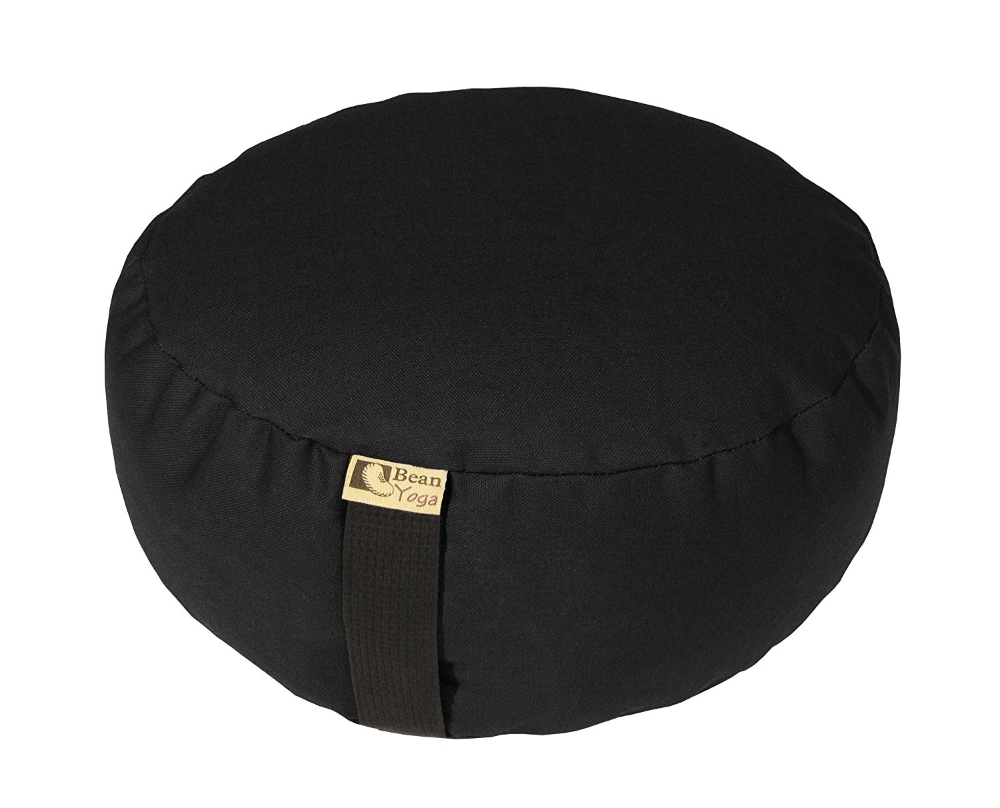

So you're interested in meditation but completely unsure of how to get started, and I can tell you with certainty that you have no fucking clue how just by the fact you're actively searching for meditation accessories; but fear not because you've inadvertently found a wise and knowledgable teacher to guide you towards enlightenment, while also appealing to your feeding your consumerists cravings.

#### The Winner

## The Nada-Cushion by Live Diagonal

This meditation cushion is nothing ordinary, in fact, it's nothing at all. A cushion that is nothing is the same cushion that has been used by Buddhists, Hindus and Taoists for centuries. 

We promise you this, if you can part ways with a bill for a meditation cushion that is literally nothing, all the while understanding that this act is not going to bring you any closer to enlightenment and is really just you losing money pointlessly and be completely undisturbed by this, you may finally understand the deepest level of zen. So go ahead, purchase the final level, which is no level at all, and maybe just maybe you'll finally find your Bodhi spot, though it certainly won't be on one of our pillows!

##### The Top 5 Reasons We Love This Product

1. Since this pillow has no matter, it takes up no room and is great for meditation on-the-go.
2. Same pillow used by [Siddhartha Gautama](https://en.wikipedia.org/wiki/Gautama_Buddha) to reach enlightenment, and if it's good enough for Buddha it should be good enough for you too.
3. Resides outside of traditional subject-object dualistic thought.
4. The only meditation pillow guaranteed not to impede your path to enlightenment.
5. The official cushion of [Zazen](https://en.wikipedia.org/wiki/Zazen) and [Vipassana](https://en.wikipedia.org/wiki/Vipassan%C4%81).

#### The Runner Up

## Zafu Meditation Cushion

This is a meditation cushion all right. The ergonomic design will aid in your meditation by taking stress off your knees, ankles and back, which can lengthen and deeper your meditation sessions. It is responsible manufactured in Chicago, U.S.A. using eco-friendly materials like hemp and buckwheat hulls. Hell, it even includes a carrying handle so you can carry this cushion around to new places and meditate at those places as well!

We recommend pairing with a [Ohm Store Tibetan Meditation Yoga Singing Bowl Set](http://amzn.to/2nDop1J).

##### The Top 3 Reasons We Love This Product

1. Since this cushion is "perfect for all levels", it's the perfect gift for that hard to buy for friend who has already reached enlightenment.
2. It comes in an XL, whoever said gluttony and enlightenment are mutually exclusive never saw this cushion!
3. One [Zafu user](https://www.amazon.com/review/R3DUR95Y9VZ8XW/ref=cm_cr_rdp_perm?ie=UTF8&ASIN=B003M1ZQA8) stated that after owning this pillow for a year one day he found it with hundreds of tiny bugs. How cool is that?